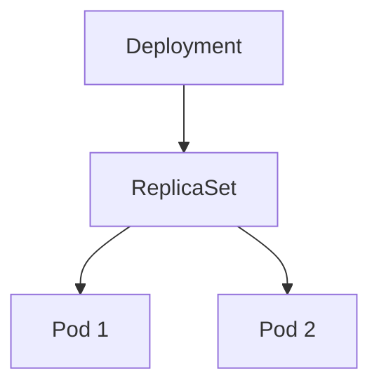

# ✍️ Uslub qo'llanmasi

Bu hujjat `k8s-education` darsligiga yangi dars yozayotgan yoki mavjudini
tahrirlayotgan har bir kishi uchun. Maqsad bitta: **123 ta fayl bitta odam
yozganday o'qilsin.**

> Qisqacha qoida: yangi dars yozishdan oldin
> [`9_Networking/220_DNS_asoslari.md`](9_Networking/220_DNS_asoslari.md) ni
> ochib ko'ring — bu darslikning etalon namunasi.

---

## 1. Dars faylining skeleti

Har bir dars **aynan shu tartibda** yoziladi. Bo'limni tashlab ketish mumkin,
lekin tartibni o'zgartirish mumkin emas.

````markdown
# Dars 220 — DNS asoslari (Linux'da name resolution)

> 🎯 **Bu darsda nimani o'rganamiz:**
> - `/etc/hosts` fayli qanday ishlaydi
> - DNS server nima uchun kerak
> - `nslookup` va `dig` buyruqlari orasidagi farq

## 💡 Hayotiy o'xshatish: telefon kitobchasi

Do'stingizning telefon raqamini yod olmaysiz — kontaktlarga ismini yozib
qo'yasiz. DNS ham xuddi shunday: `google.com` nomini `142.250.185.78`
raqamiga aylantiradi.

## <Mazmun sarlavhalari — H2>

Matn, sxema, kod bloklari...

## 🧪 Vazifa

Yechilmagan mashqlar (5-bo'limga qarang).

## ❓ Savol-Javob

**Savol:** CoreDNS va kube-dns bir xilmi?
**Javob:** Yo'q. kube-dns eski, CoreDNS 1.13 versiyadan beri standart.

## 📌 CKA imtihon uchun maslahat

Imtihonda `kubectl run test --image=busybox --rm -it -- nslookup ...`
tez tekshirish uchun eng qulay usul.

## 📖 Asosiy atamalar

| Atama | Ma'nosi |
|---|---|
| **Resolver** | Nomni IP manzilga aylantiruvchi mijoz kutubxonasi |
| **A record** | Domen nomini IPv4 manzilga bog'lovchi yozuv |

## 🔗 Manbalar

- [Kubernetes DNS for Services and Pods](https://kubernetes.io/docs/concepts/services-networking/dns-pod-service/)

---
*Bu dars KodeKloud CKA kursining 220-videosi asosida tayyorlandi.*
````

### Bo'lim belgilariga izoh

| Belgi | Bo'lim | Majburiymi |
|---|---|---|
| — | `# Dars NNN — Sarlavha` | ✅ Ha, har faylda **bitta** H1 |
| 🎯 | `> 🎯 **Bu darsda nimani o'rganamiz:**` | ✅ Ha |
| 💡 | `## 💡 Hayotiy o'xshatish:` | Tavsiya etiladi — mavhum tushuncha uchun |
| 🧪 | `## 🧪 Vazifa` | ✅ Ha |
| ❓ | `## ❓ Savol-Javob` | ✅ Ha |
| 📌 | `## 📌 CKA imtihon uchun maslahat` | CKA'ga aloqador darslarda |
| 📖 | `## 📖 Asosiy atamalar` | ✅ Ha — yangi atama kiritilgan bo'lsa |
| 🔗 | `## 🔗 Manbalar` | ✅ Ha |

Boshqa belgilar mazmun ichida: ⚠️ ogohlantirish, 📁 tayyor fayl havolasi,
🗺️ yo'l xaritasi, ➕ qo'shimcha material.

---

## 2. Sarlavhalar

- Har faylda **faqat bitta `#`** (H1) — fayl sarlavhasi.
- Mazmun `##` dan boshlanadi, keyin `###`. **Darajani tashlab ketmang** (`##` dan
  keyin darrov `####` emas).
- Sarlavha — **qisqa nom**, gap emas. Nuqta yoki ikki nuqta bilan tugamaydi.

| ❌ Noto'g'ri | ✅ To'g'ri |
|---|---|
| `### Podlarni sonini oshirgandan so'ng, deploymentning holatini tekshirish uchun quyidagi buyruqni ishlatishingiz mumkin:` | `### Deployment holatini tekshirish` |
| `## Servis yaratish maqsadi.` | `## Servis yaratish maqsadi` |
| `## Biz bindan oldingi darsda...` | `## Oldingi darsdan davomi` |

Inglizcha atama birinchi marta uchraganda qavsda beriladi:
`# Dars 301 — Ilova nosozligini aniqlash (Application Failure)`.

---

## 3. Kod bloklari

**Har bir blokka til tegi qo'yiladi.** Tegsiz blok — sintaksis bo'yalmaydi va
qidiruvda topilmaydi.

| Nima | Teg |
|---|---|
| Buyruq | ` ```bash ` |
| Manifest, konfiguratsiya | ` ```yaml ` |
| Terminal chiqishi | ` ```text ` |
| JSON | ` ```json ` |
| JavaScript | ` ```javascript ` |
| Dockerfile | ` ```dockerfile ` |

### Buyruq va uning chiqishi — alohida bloklarda

Bitta blokka buyruqni ham, chiqishni ham, o'zbekcha izohni ham tiqib
yubormang.

````markdown
❌ Noto'g'ri:
```
kubectl scale deployment nginx --replicas=5

ushbu komanda podlar sonini 5 taga oshiradi:

server001:> kubectl get pods
NAME             READY   STATUS
nginx-abc-1      1/1     Running
```

✅ To'g'ri:

Podlar sonini 5 taga oshiramiz:

```bash
kubectl scale deployment nginx --replicas=5
```

Natijani tekshiramiz:

```bash
kubectl get pods
```

```text
NAME             READY   STATUS    RESTARTS   AGE
nginx-abc-1      1/1     Running   0          10s
```
````

### Terminal prompt

Soxta prompt (`server001:>`, `serveroo1:>`, `Server001:>`) **ishlatilmaydi** —
buyruqni nusxa ko'chirganda u ham ko'chib ketadi. Blokni promptsiz yozing.

### Chiqishlar haqiqiy bo'lsin

Terminal chiqishini qo'lda "to'qib" yozmang. Agar haqiqiy chiqish bo'lmasa,
blok ustiga izoh qo'ying: *"Taxminan shunday natija chiqadi:"*. Soxta chiqish
o'quvchini chalg'itadi — masalan bir xil hash'li `OldReplicaSet` va
`NewReplicaSet` mantiqan mumkin emas.

---

## 4. Til va imlo

Til — **o'zbek tili, lotin yozuvi**. Apostrof **ASCII `'`** (`o'`, `g'`),
egri `'` emas.

### Atamalar lug'ati — faqat shu shakllar

| Tushuncha | ✅ Ishlatiladi | ❌ Ishlatilmaydi |
|---|---|---|
| cluster | **klaster** | klastr, kluster, klastor |
| pod | **pod, podlar, podning** | POD |
| container | **konteyner** (prozada) | kontayner |
| image | **image** | obraz, imidj |
| service | **servis** (prozada), `Service` (obyekt turi) | servise |
| deployment | **deployment** | deploymant, deploymnet, deplomant |
| node | **node, nodelar** | tugun |
| namespace | **namespace** | nom fazosi |
| label | **label** | metka, yorliq |
| network | **tarmoq, tarmog'i** | set |
| scaling | **masshtablash** | mashtablash |
| lesson / section | **dars** / **bo'lim** | urok |
| Kubernetes | **Kubernetes** | Kubernetis, kubernetis |

### Inglizcha so'zga o'zbekcha qo'shimcha — apostrof orqali

`Pod'lar`, `Helm'ga`, `release'lar`, `values.yaml'da`, `namespace'ingizdagi`.

### Bir marta yozilgan xatolar — takrorlamang

| Xato | To'g'ri | Darslikda uchragan |
|---|---|---|
| `deploymant` | `deployment` | 72 marta |
| `quidagi` | `quyidagi` | 21 marta |
| `kubernetis` | `Kubernetes` | 8 marta |
| `xozir` | `hozir` | 6 marta |
| `imidj` | `image` | 4 marta |
| `metka` | `label` | 4 marta |
| `xaqida` | `haqida` | 3 marta |
| `applay` | `apply` | 1 marta |
| `kubectl ger` | `kubectl get` | 1 marta |
| `kubectl ssh` | *mavjud emas* — `kubectl debug node/...` | 1 marta |

Shuningdek: `tasharidan`→`tashqaridan`, `faqrini`→`farqini`, `bu yesda`→`bu yerda`,
`xaulasa`→`xulosa`, `yaratsih`→`yaratish`, `mashtablash`→`masshtablash`,
`Dicker Desktop`→`Docker Desktop`, `NideJS`→`NodeJS`.

Bu ro'yxat CI'da avtomatik tekshiriladi — [`skriptlar/imlo-qora-royxat.txt`](skriptlar/imlo-qora-royxat.txt).

### Rus tili

Darslikda rus tilidagi matn **bo'lmasligi kerak**. Kirill harflari faqat
tarixiy misolda va tirnoq ichida uchrashi mumkin. `нodы`, `buyruqни`,
`qatори` kabi kirill/lotin duragaylari — xato.

---

## 5. Vazifalar (mashqlar)

Har darsda **yechimi darrov ko'rinmaydigan** vazifa bo'lishi kerak. Savol-Javob
bo'limi buni almashtirmaydi — u yerda javob yonida turadi.

````markdown
## 🧪 Vazifa

1. `nginx` image'idan 3 replikali deployment yarating, nomi `mashq-nginx`.
2. Uni NodePort servisi orqali tashqariga chiqaring.
3. Podlardan birini o'chiring. Nechta pod qoladi va nega?

<details>
<summary>💡 Ko'rsatma</summary>

`kubectl create deployment --help` va `kubectl expose --help` ni ko'ring.
Uchinchi savolda ReplicaSet'ning vazifasini eslang.

</details>

📁 To'liq yechim: `amaliyot/<dars-nomi>/YECHIM.md`
````

Qoidalar:
- Vazifa **bajariladigan** bo'lsin — "o'ylab ko'ring" emas, "yarating/tekshiring".
- Ko'rsatma `<details>` ichida — o'quvchi avval o'zi urinsin.
- To'liq yechim alohida faylda, dars matnida emas.

---

## 6. Amaliy fayllar — `amaliyot/`

Darsda ishlatilgan har bir manifest, skript va loyiha **haqiqiy fayl** sifatida
saqlanadi — markdown blok ichida qolib ketmaydi.

**Har bo'limda bitta `amaliyot/` papkasi bo'ladi, ichida har darsga alohida
ichki papka.** Papka nomi — dars faylining nomi (`.md` siz), harfma-harf.
Shunda qaysi fayl qaysi darsga tegishli ekani so'zsiz ravshan bo'ladi.

```
Deploymentlar/
├── create_deployment.md            ← dars fayli (nomi o'zgarmaydi)
├── depl_mashtablash.md
└── amaliyot/                       ← bo'limga qo'shiladigan YAGONA yangi papka
    ├── README.md                   ← bo'lim bo'yicha amaliyotlar ro'yxati
    ├── create_deployment/          ← nomi = dars faylining nomi
    │   ├── 01-nginx-deployment.yaml
    │   ├── 02-nginx-service.yaml
    │   ├── tozalash.sh
    │   └── YECHIM.md               ← topshiriqlarning to'liq yechimi
    └── depl_mashtablash/
        └── ...
```

Qoidalar:

- Fayl nomi: `NN-nom.yaml` — raqam qo'llash tartibini bildiradi.
  Bitta obyektli fayl uchun `<kind-kichik-harf>-<nom>.yaml` ham mumkin:
  `deployment-web.yaml`, `service-mysql.yaml`.
- `README.md` dars papkasi ichida **faqat** ichki papkalar yoki 4 tadan ko'p
  fayl bo'lsa kerak. Aks holda — ortiqcha shovqin.
- **Har bir image versiya bilan qadalgan bo'lsin:** `nginx:1.27-alpine`, hech
  qachon shunchaki `nginx`. Bu CI'da tekshiriladi.
- Faylda `...` qoldiruvchi bo'lmasin — har fayl haqiqatan `apply` bo'lishi kerak.

### Darsda fayl qanday ko'rsatiladi

Manifestni darsga to'liq nusxalash **shart emas** — muhim qismini ko'rsating,
to'lig'iga havola bering:

````markdown
> 📁 **Tayyor fayl:** `amaliyot/create_deployment/01-nginx-deployment.yaml`

```yaml
spec:
  replicas: 3          # nechta nusxa ishlashi kerak
  template:
    spec:
      containers:
        - name: nginx
          image: nginx:1.27
```

Qo'llash:

```bash
kubectl apply -f amaliyot/01-nginx-deployment.yaml
```
````

Maxsus tuzilmalar:

| Bo'lim | `amaliyot/<dars>/` ichi |
|---|---|
| Kustomize | `base/`, `overlays/{dev,staging,production}/`, `components/` |
| Troubleshooting | `buzilgan/` (ataylab nosoz) + `tuzatilgan/` + `FARQ.md` |
| Mock imtihonlar | `SAVOLLAR.md` (yechimsiz) + `yechimlar/01_*.yaml` |
| Helm | `Chart.yaml`, `values.yaml`, `templates/` |

**Troubleshooting oqimi:** o'quvchi `buzilgan/` dagi faylni `apply` qiladi,
o'zi topib tuzatadi, keyin `FARQ.md` ni ochib solishtiradi. `FARQ.md` ikki
papkadan skript bilan generatsiya qilinadi — shuning uchun hech qachon
mos kelmay qolmaydi.

**Mock imtihonlar oqimi:** `SAVOLLAR.md` da faqat masalalar — vaqt belgilab
o'zingiz yechasiz. Yechimlar alohida papkada.

---

## 7. Sxemalar

### Mermaid — birinchi tanlov

GitHub va VS Code mermaid'ni o'zi chizadi, u matn — diff qilinadi va
tahrirlash oson. Oqim, ierarxiya, qaror daraxti uchun **doim mermaid**.

````markdown

````

⚠️ **Mermaid yorliqlari doim qo'shtirnoq ichida bo'lsin:** `A["..."]`, `A{"..."}`.
Qo'shtirnoq ichida apostrof (`tarmog'i`), tire va tinish belgilari bemalol
ishlatiladi — parser ularni matn deb qabul qiladi. Qo'shtirnoqsiz yorliqda esa
apostrof va `(` `)` blokni buzadi.

| ❌ | ✅ |
|---|---|
| `A[Tarmog'i]` | `A["Tarmog'i"]` |
| `B[Pod (asosiy birlik)]` | `B["Pod (asosiy birlik)"]` |

Qator ko'chirish uchun `<br/>` ishlatiladi.

Darslikdagi 108 ta mermaid bloki allaqachon shu qoidaga amal qiladi —
yangisini yozganda buzmang.

### SVG — mermaid uddalay olmaganda

Qatlamli arxitektura, paket yo'li, yonma-yon taqqoslash panellari uchun qo'lda
yozilgan SVG. Fayllar bo'lim ichidagi `rasmlar/` papkasida:
`rasmlar/<dars-raqami>-<mavzu>.svg`, faqat ASCII nom.

#### Nega SVG shunday yoziladi

Markdown SVG'ni `` sifatida yuklaydi — sahifaning temasi SVG ichiga
**ta'sir qilmaydi**. `@media (prefers-color-scheme: dark)` ham yaramaydi: u
brauzer/OS sozlamasiga qaraydi, GitHub'ning tema tugmasiga emas. Ya'ni OS'i
yorug', GitHub'i qorong'i bo'lgan o'quvchi noto'g'ri variantni ko'radi.

`<picture>` bilan ikkita fayl berish mumkin, lekin u faqat GitHub sahifasida
ishlaydi — `raw.githubusercontent`, VS Code preview, GitHub Pages va PDF
eksportida sinadi va har sxema ikki nusxada saqlanadi.

**Shuning uchun bitta qoida:** har SVG **o'z fonini olib yuradi** va qorong'i
siyoh bilan chiziladi. Bitta fayl, hamma joyda bir xil.

- Birinchi element — butun kanvasni qoplaydigan `<rect>`.
- `<style>` bloki, `@media`, `class`, `currentColor`, `var(--...)` va tashqi
  shrift **ishlatilmaydi** (GitHub sanitizeri va boshqa renderlar ularni tashlaydi).
- `<title>` + `<desc>` + `role="img" aria-labelledby` — ekran o'quvchilar uchun.
- Matn kontrasti WCAG AA (≥ 4.5:1).

#### Qat'iy palitra

Bu ranglar `#1A1A18` matn bilan ≥ 4.5:1 kontrast beradi va rang ko'rmaslikda
ham bir-biridan farqlanadi. Yangi rang **o'ylab topmang**.

| Rol | Fon | Chegara |
|---|---|---|
| Kanvas / ramka | `#FBFBFA` | `#D8D6D1` |
| Asosiy matn | `#1A1A18` | — |
| Ikkilamchi matn | `#5C5A55` | — |
| Control plane, apiserver | `#DCE9F7` | `#2C6FB5` |
| Pod, workload | `#DDF0E5` | `#2A7D53` |
| Service, tarmoq | `#E5E2F7` | `#5B4FBE` |
| Ogohlantirish | `#FBEBD2` | `#B5761A` |
| Xato / nosozlik | `#F8DFDF` | `#B33A3A` |

#### Skelet

```xml
<svg xmlns="http://www.w3.org/2000/svg" viewBox="0 0 720 420" width="720"
     role="img" aria-labelledby="sarlavha izoh"
     font-family="system-ui,-apple-system,Segoe UI,Roboto,Helvetica,Arial,sans-serif">
  <title id="sarlavha">Service va kube-proxy qanday ishlaydi</title>
  <desc id="izoh">kubectl so'rovi apiserver'ga boradi, apiserver Service'ga IP
    beradi, har node'dagi kube-proxy iptables DNAT qoidasini yozadi.</desc>

  <!-- MAJBURIY: o'z foni — yorug' va qorong'i temada bir xil ko'rinadi -->
  <rect x="0" y="0" width="720" height="420" rx="12" fill="#FBFBFA"
        stroke="#D8D6D1" stroke-width="1"/>

  <rect x="40" y="40" width="200" height="64" rx="8" fill="#DCE9F7"
        stroke="#2C6FB5" stroke-width="1.5"/>
  <text x="140" y="66" text-anchor="middle" font-size="15" font-weight="600"
        fill="#1A1A18">kube-apiserver</text>
  <text x="140" y="86" text-anchor="middle" font-size="12"
        fill="#5C5A55">Service'ga IP beradi</text>
</svg>
```

Qorong'i temada sxema **yorug' kartochka** bo'lib ko'rinadi — bu ataylab.
Yumaloq chegara uni "xato render" emas, "alohida panel" qilib ko'rsatadi;
kubernetes.io va CNCF ham sxemalarini shunday tarqatadi.

> ⚠️ `Servislar/kubectl_expose_loadbalancer_flow-1.svg` — aynan shu qoidaga
> zid yozilgan eski fayl: fon to'rtburchagi yo'q, barcha matn **och rangda**.
> Shuning uchun u GitHub'ning yorug' temasida **umuman ko'rinmaydi**. Yangi
> sxema yozganda shu xatoni takrorlamang.

### Skrinshotlar

Skrinshot — sxemaning o'rnini bosmaydi. U faqat "ekranda aynan shunday
ko'rinadi" degan joyda kerak.

**Alt-matn har doim mazmunli bo'lsin.** `` — VS Code rasmni
qo'yganda avtomatik yozadigan bo'sh qolip. Uni albatta almashtiring:

| ❌ | ✅ |
|---|---|
| `` — bo'sh qolip | `` |

---

## 8. Bo'lim `README.md` fayli

Har papkada indeks bo'ladi:

1. `# 🌐 N-bo'lim — Nomi` emoji bilan
2. Bo'lim haqida 2-3 gap
3. `mermaid` yo'l xaritasi
4. `## 📚 Darslar tartibi` — `| # | Fayl | Mavzu |` jadvali, har fayl havola bilan
5. `## 💡 Qanday o'qish kerak`
6. `## 🔗 Umumiy manbalar`
7. Manba izohi bilan yakun

Namuna: [`9_Networking/README.md`](9_Networking/README.md).

---

## 9. Yozishdan oldin tekshirish ro'yxati

- [ ] Faylda bitta `#` H1 bor va u `# Dars NNN — ...` ko'rinishida
- [ ] `> 🎯 Bu darsda nimani o'rganamiz` bloki bor
- [ ] Har kod blokida til tegi bor
- [ ] Buyruq va chiqish alohida bloklarda, soxta prompt yo'q
- [ ] Terminal chiqishi haqiqiy yoki "namuna" deb belgilangan
- [ ] Mermaid yorliqlari qo'shtirnoqda va apostrofsiz
- [ ] Har rasmda mazmunli alt-matn
- [ ] Manifestlar `amaliyot/` da haqiqiy fayl sifatida bor
- [ ] `## 🧪 Vazifa` bo'limi bor, yechimi alohida faylda
- [ ] Atamalar 4-bo'limdagi lug'atga mos
- [ ] Bo'lim `README.md` jadvaliga yangi dars qo'shildi

Avtomatik tekshirish:

```bash
bash skriptlar/tekshir.sh
```

---
*Bu qo'llanma darslikning mavjud eng yaxshi darslari (`9_`–`18_` bo'limlar)
asosida yozildi — u yangi qoida o'ylab topmaydi, allaqachon ishlab turgan
uslubni yozib qo'yadi.*
