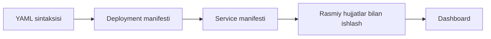

# 📄 YAML manifestlar

Kubernetes bilan jiddiy ishlash YAML'dan boshlanadi. Manifest anatomiyasi, `kubectl apply`, rasmiy hujjatlardan namuna olish va Dashboard'ni o'rnatish.

## 📚 Darslar tartibi

| # | Fayl | Mavzu |
|---|---|---|
| 1 | [lesson1.md](lesson1.md) | Deployment uchun YAML fayl yaratish; YAML ma'lumot turlari |
| 2 | [lesson2.md](lesson2.md) | Manifestni klasterga qo'llash va yangilash |
| 3 | [lesson3.md](lesson3.md) | kubernetes.io hujjatlaridan namuna olish |
| 4 | [lesson4.md](lesson4.md) | Service manifestini yozish va ishga tushirish |
| 5 | [lesson5.md](lesson5.md) | Kubernetes Dashboard: o'rnatish va kirish |
| 6 | [lesson6.md](lesson6.md) | Servis va deploymentlarni o'chirish |

## 💡 Qanday o'qish kerak

1. Darslarni jadvaldagi tartibda o'qing — har biri oldingisiga tayanadi.
2. Buyruqlarni o'z klasteringizda qaytaring. O'qish emas, qilish esda qoladi.
3. `amaliyot/` papkasidagi tayyor fayllardan foydalaning — qo'lda ko'chirish shart emas.
4. Har dars oxiridagi `🧪 Mustaqil topshiriqlar` ni yechimni ochishdan oldin bajaring.

## 🔗 Manbalar

- [Kubernetes rasmiy hujjatlari](https://kubernetes.io/docs/home/)
- [kubectl Cheat Sheet](https://kubernetes.io/docs/reference/kubectl/quick-reference/)

➡️ **Keyingi bo'lim:** [Deploymentlar](../Deploymentlar/)

---
⬅️ [Kurs bosh sahifasi](../README.md) · 📖 [Uslub qo'llanmasi](../USLUB.md)
