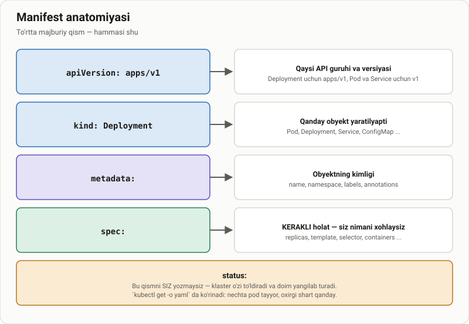
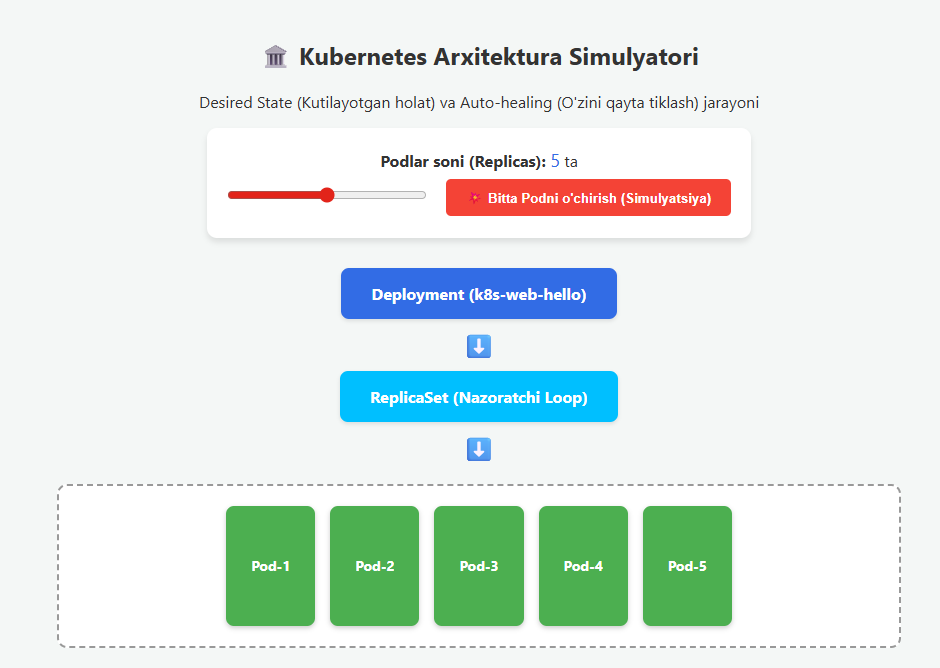

# Deployment uchun YAML fayl yaratish

> 🎯 **Bu darsda nimani o'rganamiz:**
> - Manifestning to'rt majburiy qismi: apiVersion, kind, metadata, spec
> - YAML'dagi ma'lumot turlari: satr, son, ro'yxat, lug'at
> - `selector` va `template.labels` nima uchun mos kelishi kerak
> - Resurs so'rovlari va limitlari (`requests`, `limits`)



## 📄 YAML fayllarida ma'lumot turlari

Ushbu qo'llanma Kubernetes tizimida `Deployment` yaratishni, uning arxitekturasini va YAML fayllarini to'g'ri yozish qoidalarini o'rganishga mo'ljallangan.

---

## 🏗️ 1-qism: Kubernetes Deployment obyekti

Kubernetes'da ilovalarni uzluksiz ishlatish uchun `Deployment` obyektidan foydalaniladi.

## 📄 Amaliy misol (k8s-web-hello loyihasi)

```yaml
apiVersion: apps/v1
kind: Deployment

metadata:
  name: k8s-web-hello

spec:
  replicas: 5

  selector:
    matchLabels:
      app: k8s-web-hello

  template:
    metadata:
      labels:
        app: k8s-web-hello

    spec:
      containers:
        - name: k8s-web-hello
          image: mrpocker88/k8s-web-hello:1.0.2

          resources:
            limits:
              memory: "128Mi"
              cpu: "250m"

          ports:
            - containerPort: 3000
```


📖 Qatorlar bo'yicha lug'at
apiVersion

Kubernetes bilan qaysi API versiyasida ishlayotganimizni bildiradi.
```yaml
apiVersion: apps/v1
```
kind
Qanday turdagi resurs yaratilayotganini bildiradi.
```yaml
kind: Deployment
```
metadata
Resurs haqida umumiy ma'lumotlar.
metadata:
```yaml 
 name: k8s-web-hello
```
spec
Deployment qanday ishlashi kerakligini belgilaydi.
```yaml
spec:
```
replicas
Ilovaning nechta nusxasi ishlashi kerakligini ko'rsatadi.
```yaml
replicas: 5
```
selector.matchLabels
Deployment qaysi Podlarni boshqarishini bildiradi.
```yaml
selector:
  matchLabels:
    app: k8s-web-hello
```

template
Yangi Pod yaratish uchun qolip.
```yaml
template:
```

containers.image
Qaysi Docker image ishlatilishini ko'rsatadi.
```yaml
image: mrpocker88/k8s-web-hello:1.0.2
```

resources.limits
Container ishlatishi mumkin bo'lgan maksimal resurslar.
```yaml
resources:
  limits:
    memory: "128Mi"
    cpu: "250m"
```

ports.containerPort
Container ichidagi ochiq port.
```yaml
ports:
  - containerPort: 3000
  ```
🏭 2-QISM: Kubernetes Arxitekturasi

Kubernetes ichida bir nechta qatlamlar ishlaydi.

🏢 Deployment — Zavod boshqaruvchisi

Deployment umumiy nazoratni olib boradi.

Misol:

“Doim 5 ta Pod ishlab tursin.”

Agar Pod o'chsa, Deployment uni qayta tiklaydi.

👨‍🔧 ReplicaSet — Smena ustasi

ReplicaSet Podlar sonini nazorat qiladi.

Agar kerakli son kamayib ketsa:

yangi Pod yaratadi
avtomatik tiklaydi (Auto Healing)
📦 Pod — Ishchi xonasi

Pod — Kubernetes'dagi eng kichik ishchi obyekt.

Har bir Pod ichida:

1 yoki bir nechta container bo'ladi
alohida IP bo'ladi
alohida tarmoq muhiti bo'ladi
🐳 Container — Dasturning o'zi

Bu Docker image orqali ishga tushadigan asosiy dastur.

Misol:
```
image: mrpocker88/k8s-web-hello:1.0.2
```

## 📝 3-QISM: YAML Faylni Oddiy Tilda O'qish

Kubernetes'ga yuborilgan buyruq oddiy tilda quyidagicha bo'ladi:

> “Salom Kubernetes.
> Menga `k8s-web-hello` nomli loyiha yarat.
> Har doim 5 ta nusxa ishlasin.
> Har bir nusxaga `app: k8s-web-hello` yorlig'ini ber.
> Internetdan `mrpocker88/k8s-web-hello:1.0.2` image yuklab ishlat.
> Har biri maksimum 128MB RAM va 250m CPU ishlatsin.
> 3000-port ochiq bo'lsin.”

---

## 🧩 4-QISM: YAML Sintaksisi va Ma'lumot Turlari

YAML — inson o'qishi uchun qulay konfiguratsiya tili.

---

## 1️⃣ Oddiy Ma'lumot Turlari (Scalars)

```yaml
ism: Ali
yosh: 25
harorat: 36.6
talabami: true
avtomobil: null
```

2️⃣ Ro'yxatlar (Lists / Sequences)
- belgisi bilan yoziladi.
```yaml
dasturlash_tillari:
  - Python
  - JavaScript
  - Java
  ```
3️⃣ Lug'atlar (Mappings / Dictionaries)
Kalit-qiymat juftliklari.
```yaml
shaxs_malumotlari:
  ism: Vali
  familiya: Aliyev
  yosh: 30
```
4️⃣ Ko'p Qatorli Matnlar (Multiline Strings)
|
Qatorlarni saqlab qoladi.
```yaml
izoh: |
  Bu birinchi qator.
  Bu ikkinchi qator.
```
>
Qatorlarni birlashtirib yuboradi.
```yaml
izoh: >
  Bu juda uzun gap bo'lishi mumkin,
  lekin YAML uni bitta qator sifatida
  o'qiydi.
```
⚠️ ENG MUHIM QOIDA
❌ TAB ishlatmang

YAML fayllarda TAB qat'iyan taqiqlanadi.

Faqat SPACE ishlating.
--------------------------------------
✅ To'g'ri format
```yaml
spec:
  containers:
    - name: nginx
```
❌ Noto'g'ri format
```yaml
spec:
<TAB>containers:
```

## 📁 Tayyor fayllar

Bu darsdagi manifestlar `amaliyot/` papkasida ishlaydigan fayl sifatida turadi:

- [`amaliyot/lesson1/01-deployment.yaml`](amaliyot/lesson1/01-deployment.yaml)
- [`amaliyot/lesson1/02-service.yaml`](amaliyot/lesson1/02-service.yaml)

```bash
kubectl apply -f amaliyot/lesson1/01-deployment.yaml
kubectl apply -f amaliyot/lesson1/02-service.yaml
```

Bu bo'limda interaktiv simulyator ham bor —
[`amaliyot/lesson1/simulyator.html`](amaliyot/lesson1/simulyator.html)
faylini brauzerda oching.

## 🧪 Mustaqil topshiriqlar

> Taxminiy vaqt: 20 daqiqa.

**1-topshiriq · oson.** `01-deployment.yaml` dagi `replicas` ni 3 ga
o'zgartiring va qo'llang.

<details><summary>O'zingizni tekshiring</summary>

```bash
kubectl get deployment k8s-web-hello -o jsonpath='{.spec.replicas}{"\n"}'
```
</details>

**2-topshiriq · o'rta.** Manifestga `livenessProbe` qo'shing: `/` yo'liga
HTTP GET, 3000-portda.

<details><summary>O'zingizni tekshiring</summary>

```bash
kubectl describe deployment k8s-web-hello | grep -i liveness
```
</details>

**3-topshiriq · qiyin.** `selector.matchLabels` ni `template.metadata.labels`
dan farqli qiling. **Avval ayting:** `kubectl apply` nima deydi?

<details><summary>O'zingizni tekshiring</summary>

```text
`selector` does not match template `labels`
```
</details>

📁 To'liq yechimlar: [`amaliyot/lesson1/YECHIM.md`](amaliyot/lesson1/YECHIM.md)

## ❓ Savol-Javob

**Savol:** `apiVersion` da `v1` va `apps/v1` farqi nima?
**Javob:** `v1` — asosiy (core) API guruhi: Pod, Service, ConfigMap, Secret.
`apps/v1` — ilovalar guruhi: Deployment, ReplicaSet, StatefulSet, DaemonSet.
Qaysi obyekt qaysi guruhda ekanini `kubectl api-resources` ko'rsatadi.

**Savol:** YAML'da tab ishlatsam bo'ladimi?
**Javob:** Yo'q. YAML **tabni qabul qilmaydi** — faqat bo'shliq. Bu eng ko'p
uchraydigan sintaksis xatosi.

**Savol:** `requests` va `limits` farqi nima?
**Javob:** `requests` — Pod'ni joylashtirish uchun **kafolatlangan** minimum;
scheduler shunga qarab node tanlaydi. `limits` — yuqori chegara; undan
oshsa konteyner cheklanadi (CPU) yoki o'ldiriladi (xotira, OOMKilled).

**Savol:** `250m` nima degani?
**Javob:** 250 millicore — bitta CPU yadrosining chorak qismi.
`1000m` = `1` = butun yadro.

## 📌 CKA imtihon uchun maslahat

Manifestni qo'lda yozmang:

```bash
kubectl create deployment web --image=nginx:1.27-alpine \
  --dry-run=client -o yaml > deploy.yaml
```

Maydon nomini unutsangiz — hujjatlarni ochish shart emas:

```bash
kubectl explain deployment.spec.template.spec.containers
kubectl explain deployment --recursive | head -40
```

## 📖 Asosiy atamalar

| Atama | Ma'nosi |
|---|---|
| **`apiVersion`** | Obyekt qaysi API guruhi va versiyasiga tegishli |
| **`kind`** | Obyekt turi: Pod, Deployment, Service ... |
| **`metadata`** | Obyektning nomi, namespace'i va labellari |
| **`spec`** | Kerakli holat — siz nimani xohlaysiz |
| **`status`** | Haqiqiy holat — klaster o'zi to'ldiradi |
| **millicore (`m`)** | CPU o'lchov birligi; `1000m` = 1 yadro |
| **OOMKilled** | Konteyner xotira limitidan oshgani uchun o'ldirilgan |

## 🔗 Manbalar

- [Kubernetes Object Management](https://kubernetes.io/docs/concepts/overview/working-with-objects/)
- [Resource Management for Pods](https://kubernetes.io/docs/concepts/configuration/manage-resources-containers/)
- [kubectl explain](https://kubernetes.io/docs/reference/generated/kubectl/kubectl-commands#explain)

---
⬅️ [Bo'lim indeksi](README.md) · ➡️ Keyingi dars: [lesson2.md](lesson2.md)
