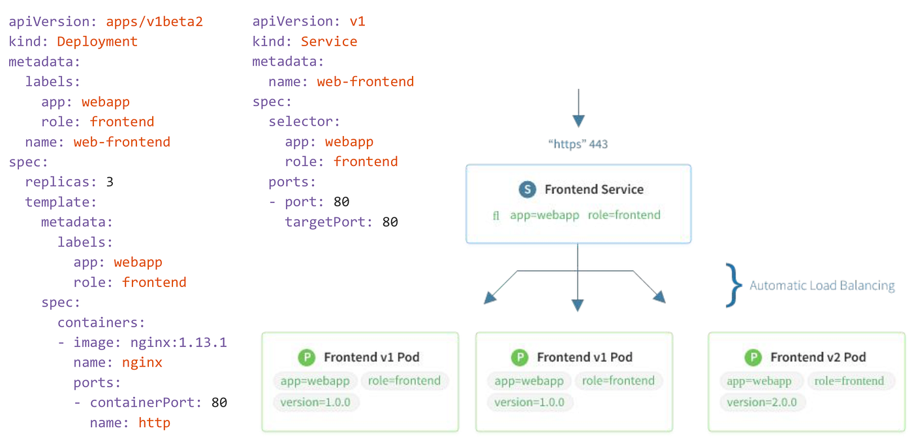

# Kubernetes service yaml fayl yaratish va ishga tushirish

> 🎯 **Bu darsda nimani o'rganamiz:**
> - Service manifestini yozish va qo'llash
> - `port` va `targetPort` ni to'g'ri tanlash
> - LoadBalancer servisni minikube'da sinash

Kubernetes klasterida `Service` yaratish uchun `YAML` fayl yaratishni o'rganishga mo'ljallangan.
Hozirda biz yaratgan <service.yaml> fayli mavjud va biz uni kubernetes klasterida ishga tushiramiz:
buning uchun quyidagi buyruqni ishlatamiz:
```bash
kubectl apply -f service.yaml
```
Bu buyruq yordamida siz kubernetes klasteriga `service` yaratishingiz mumkin.   
Servis yaratish uchun quyidagi buyruqni ishlatishingiz mumkin:

```yaml
apiVersion: v1
kind: Service
metadata:
  name: k8s-web-hello
spec:
  type: LoadBalancer
  selector:
    app: k8s-web-hello
  ports:
  - port: 3030
    targetPort: 3000
```
bu yerda  biz `k8s-web-hello` nomli servis yaratdik va '3030' portni `3000` TargetPort qilib qo'ydik.
shu bilan birgalikda <app: k8s-web-hello> bu deploymendga boylanishini bildiradi.
Agarda siz minikube ishlatsangiz bu servisni tekshirish uchun 'Minikube tunnel' ni yoqib qo'yishingiz kerak.

```bash
minikube tunnel
```


Endi bo'lsa service.yaml faylini ishga tushiramiz va analiz qilib chiqamiz:
```bash
root@test-server-k8s-1:~# kubectl apply -f service.yaml
service/k8s-web-hello unchanged
root@test-server-k8s-1:~# kubectl get services
NAME            TYPE           CLUSTER-IP      EXTERNAL-IP   PORT(S)          AGE
k8s-web-hello   LoadBalancer   10.100.61.176   <pending>     3030:30760/TCP   117s
kubernetes      ClusterIP      10.96.0.1       <none>        443/TCP          3d1h
root@test-server-k8s-1:~# kubectl describe service k8s-web-hello
Name:                     k8s-web-hello
Namespace:                default
Labels:                   <none>
Annotations:              <none>
Selector:                 app=k8s-web-hello
Type:                     LoadBalancer
IP Family Policy:         SingleStack
IP Families:              IPv4
IP:                       10.100.61.176
IPs:                      10.100.61.176
Port:                     <unset>  3030/TCP
TargetPort:               3000/TCP
NodePort:                 <unset>  30760/TCP
Endpoints:                172.16.138.247:3000,172.16.91.93:3000,172.16.78.160:3000 + 7 more...
Session Affinity:         None
External Traffic Policy:  Cluster
Internal Traffic Policy:  Cluster
Events:                   <none>
root@test-server-k8s-1:~# kubectl get pods -o wide
NAME                             READY   STATUS    RESTARTS   AGE   IP               NODE                NOMINATED NODE   READINESS GATES
k8s-web-hello-7c47cb8cd8-96tnn   1/1     Running   0          86m   172.16.78.163    test-server-k8s-2   <none>           <none>
k8s-web-hello-7c47cb8cd8-9kx4s   1/1     Running   0          87m   172.16.78.160    test-server-k8s-2   <none>           <none>
k8s-web-hello-7c47cb8cd8-ctdpm   1/1     Running   0          86m   172.16.138.249   test-server-k8s-1   <none>           <none>
k8s-web-hello-7c47cb8cd8-d84b2   1/1     Running   0          87m   172.16.138.247   test-server-k8s-1   <none>           <none>
k8s-web-hello-7c47cb8cd8-d89g9   1/1     Running   0          87m   172.16.91.92     test-server-k8s-3   <none>           <none>
k8s-web-hello-7c47cb8cd8-dbzkn   1/1     Running   0          86m   172.16.78.162    test-server-k8s-2   <none>           <none>
k8s-web-hello-7c47cb8cd8-dvrt5   1/1     Running   0          86m   172.16.91.94     test-server-k8s-3   <none>           <none>
k8s-web-hello-7c47cb8cd8-kftpv   1/1     Running   0          87m   172.16.91.93     test-server-k8s-3   <none>           <none>
k8s-web-hello-7c47cb8cd8-n5xfh   1/1     Running   0          86m   172.16.138.250   test-server-k8s-1   <none>           <none>
k8s-web-hello-7c47cb8cd8-rsdqq   1/1     Running   0          87m   172.16.78.161    test-server-k8s-2   <none>           <none>
```

## 🧪 Mustaqil topshiriqlar

> Taxminiy vaqt: 15 daqiqa.

**1-topshiriq · oson.** `02-service.yaml` ni qo'llang va Service turini
tekshiring.

<details><summary>O'zingizni tekshiring</summary>

```bash
kubectl get svc k8s-web-hello -o jsonpath='{.spec.type}{"\n"}'
```
</details>

**2-topshiriq · o'rta.** `minikube tunnel` ni ishga tushirib, ilovani
brauzerdan oching.

<details><summary>O'zingizni tekshiring</summary>

```bash
kubectl get svc k8s-web-hello -o jsonpath='{.status.loadBalancer.ingress[0].ip}{"\n"}'
```
</details>

**3-topshiriq · qiyin.** `targetPort` ni 3001 ga o'zgartiring.
**Avval ayting:** Service ishlaydimi? `Endpoints` nima ko'rsatadi?

<details><summary>O'zingizni tekshiring</summary>

```bash
kubectl get endpoints k8s-web-hello
# Endpoints TO'LADI (podlar mos keladi), lekin so'rov javobsiz qoladi —
# 3001-portda hech kim tinglamayapti
```
</details>

## ❓ Savol-Javob

**Savol:** `targetPort` noto'g'ri bo'lsa `Endpoints` bo'sh bo'ladimi?
**Javob:** Yo'q. `Endpoints` **selektor** bo'yicha to'ladi, port bo'yicha
emas. Shuning uchun bu nosozlikni topish qiyinroq: Service "sog'lom"
ko'rinadi, lekin so'rovga javob yo'q.

**Savol:** Bitta Service'da bir necha port bo'lishi mumkinmi?
**Javob:** Ha. U holda har portga `name` berish **majburiy**.

## 📌 CKA imtihon uchun maslahat

```bash
kubectl create service clusterip web --tcp=80:8080 --dry-run=client -o yaml
kubectl expose deploy web --port=80 --target-port=8080 --dry-run=client -o yaml
```

`--tcp=<port>:<targetPort>` sintaksisini yod oling — u eng tez.

## 📖 Asosiy atamalar

| Atama | Ma'nosi |
|---|---|
| **`port`** | Service'ning o'z porti |
| **`targetPort`** | So'rov uzatiladigan konteyner porti |
| **`nodePort`** | Node'da ochiladigan port (30000-32767) |
| **Named port** | Ko'p portli Service'da har portga beriladigan nom |

## 🔗 Manbalar

- [Service — kubernetes.io](https://kubernetes.io/docs/concepts/services-networking/service/)
- [Connecting Applications with Services](https://kubernetes.io/docs/tutorials/services/connect-applications-service/)

---
⬅️ [Oldingi dars](lesson3.md) · [Bo'lim indeksi](README.md) · ➡️ [lesson5.md](lesson5.md)
