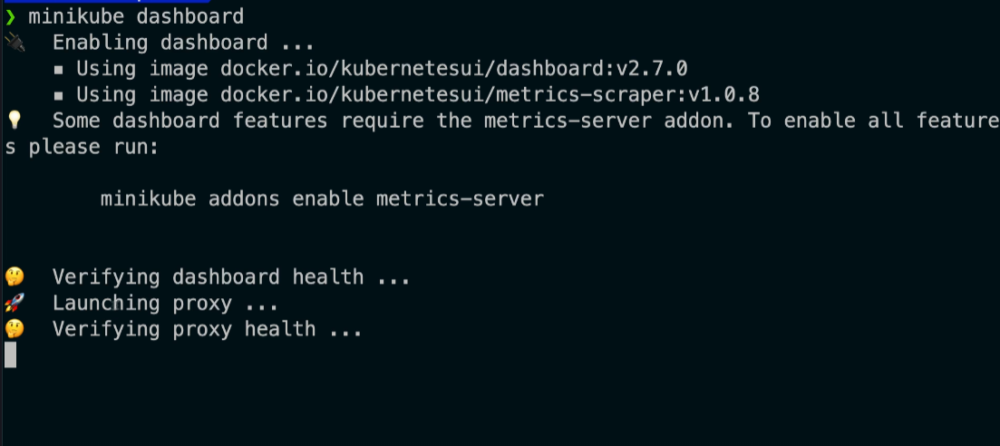
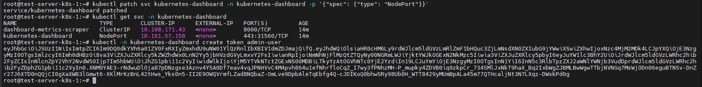
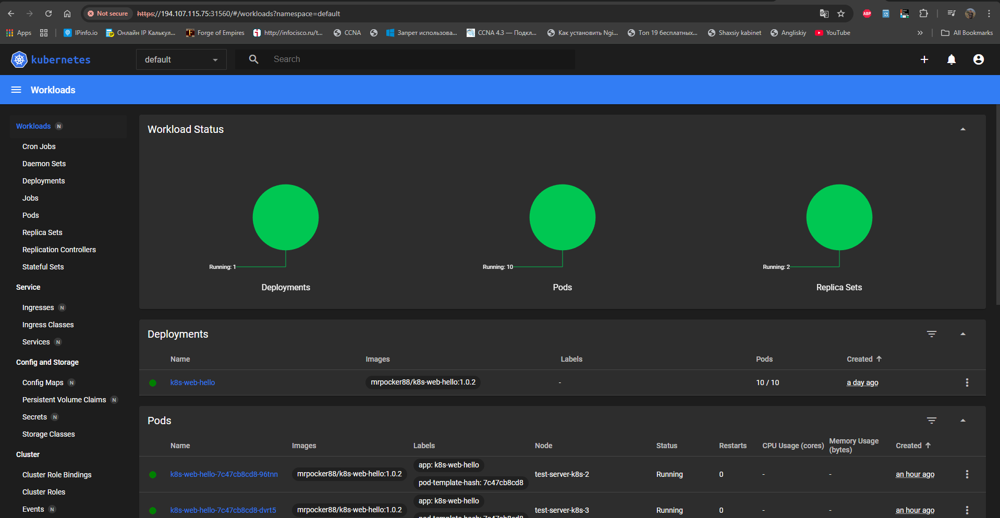

### Web interfacelik dashbor servisi
agar siz minikube ishlatayotgan bo'lsandiz quyidagi buyruqni ishlatishingiz mumkin:
```bash
minikube dashboard
```
va siz ekraningizda quyidagi ma'lumotni ko'rishingiz mumkin.


Kubernetes Dashboard-ni ishga tushirish qo'llanmasi
Kubernetes-da grafik interfeysni (Dashboard) ishga tushirish uchun (agar siz minikube ishlatmayotgan bo'lsangiz), uni alohida o'rnatish va kirish huquqini sozlash kerak. Quyida buni amalga oshirishning qadamma-qadam yo'riqnomasi keltirilgan.
1. Dashboard-ni o'rnatish
Rasmiy manifest yordamida Dashboard komponentlarini klasteringizga yuklang:
```bash
kubectl apply -f https://raw.githubusercontent.com/kubernetes/dashboard/v2.0.0/aio/deploy/recommended.yaml
```
2. Administrator foydalanuvchisini yaratish
Dashboard-ga kirish uchun maxsus ruxsatnomaga ega foydalanuvchi (Service Account) kerak.

admin-user.yaml nomli fayl yarating va quyidagi kodni ichiga joylang:
```yaml
apiVersion: v1
kind: ServiceAccount
metadata:
  name: admin-user
  namespace: kubernetes-dashboard
---
apiVersion: rbac.authorization.k8s.io/v1
kind: ClusterRoleBinding
metadata:
  name: admin-user
roleRef:
  apiGroup: rbac.authorization.k8s.io
  kind: ClusterRole
  name: cluster-admin
subjects:
- kind: ServiceAccount
  name: admin-user
  namespace: kubernetes-dashboard
  ```
Ushbu sozlamani klasterga kiriting:
```bash
kubectl apply -f admin-user.yaml
```
Eslatma: Chiqqan uzun kodni nusxalab oling, u brauzerda tizimga kirish uchun kerak bo'ladi.
4. Dashboard-ga ulanish (Proxy)
Dashboard-ni brauzerda ochish uchun portni yo'naltirish (proxy) kerak:

Usul A: Standart Proxy
```bash
kubectl proxy
``` 
Endi Dashboard-ga quyidagi havola orqali kirishingiz mumkin:
http://localhost:8001/api/v1/namespaces/kubernetes-dashboard/services/https:kubernetes-dashboard:/proxy/

Dashboard-ni Service (NodePort) orqali sozlash
Agar sizga port-forward yoqmasa, servis turini o'zgartirib, uni doimiy ochiq portga biriktirib qo'yishingiz mumkin.

Servis turini NodePort-ga o'zgartirish
Mavjud servisni tahrirlash uchun quyidagi buyruqni bajaring:
```bash
kubectl patch svc kubernetes-dashboard -n kubernetes-dashboard -p '{"spec": {"type": "NodePort"}}'
```
Portni aniqlash
Kubernetes Dashboard uchun qaysi port tayinlanganini bilish uchun:
```bash
kubectl get svc -n kubernetes-dashboard
```
Token bilan kirish
```bash
kubectl -n kubernetes-dashboard create token admin-user
```

Dashboard-ga quyidagi havola orqali kirishingiz mumkin:




Minikube va oddiy Kubernetes o'rtasidagi farqlar:
Vazifa,Minikube,Oddiy Kubernetes
Buyruq,minikube dashboard,kubectl proxy yoki port-forward
O'rnatish,Avtomatik tayyor bo'ladi,kubectl apply orqali o'rnatiladi
Avtorizatsiya,Talab qilinmaydi,Token yoki Kubeconfig kerak
