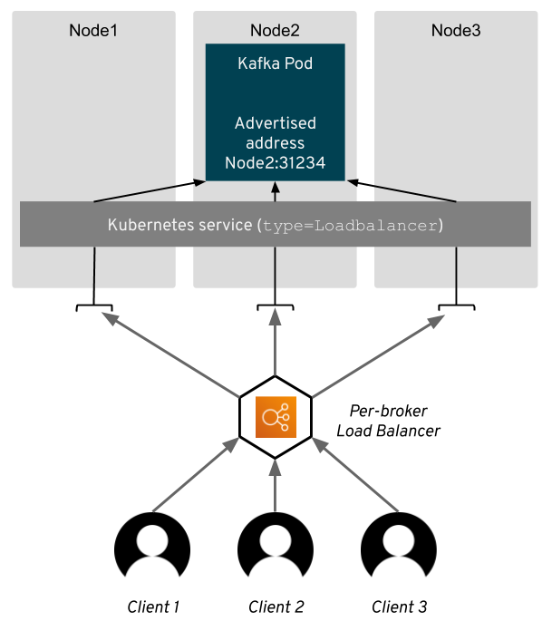

## LoadBalancer turidagi servis yaratish
NodePort turidagi servis yaratganimizdan so'ng, endi LoadBalancer turidagi servis yaratamiz. LoadBalancer turidagi servis, klaster ichidagi podlarga tashqi dunyo orqali kirish imkonini beradi va yuk balanslashni amalga oshiradi.
"Savol:" LoadBalancer turidagi servis qaysi nodelarda yaratiladi?
"Javob:" LoadBalancer turidagi servis, klaster ichidagi barcha nodelarda yaratiladi.



## servislarning 4 turdagi ko'rinishi
Kubernetesda servislarning 4 turi mavjud: ClusterIP, NodePort, LoadBalancer va ExternalName. Har bir servis turi o'ziga xos xususiyatlarga ega va turli vazifalar uchun ishlatiladi.
- ClusterIP: Bu servis turi, klaster ichidagi podlarga kirish imkonini beradi, lekin tashqi dunyo bilan aloqa qilish imkonini bermaydi. Bu servis turi, klaster ichidagi xizmatlarni bir-biri bilan aloqa qilish uchun ishlatiladi.
- NodePort: Bu servis turi, klaster ichidagi podlarga tashqi dunyo orqali   kirish imkonini beradi. NodePort turidagi servis, klaster ichidagi barcha nodelarda yaratiladi va tashqi dunyo orqali kirish uchun port raqamini belgilaydi.
- LoadBalancer: Bu servis turi, klaster ichidagi podlarga tashqi dunyo orqali   kirish imkonini beradi va yuk balanslashni amalga oshiradi. LoadBalancer turidagi servis, klaster ichidagi barcha nodelarda yaratiladi va tashqi dunyo orqali kirish uchun port raqamini belgilaydi.
- ExternalName: Bu servis turi, klaster ichidagi podlarga tashqi dunyo orqali   kirish imkonini beradi, lekin bu servis turi, klaster ichidagi podlarga tashqi dunyo orqali kirish uchun DNS nomini belgilaydi. Bu servis turi, klaster ichidagi podlarga tashqi dunyo orqali kirish uchun DNS nomini belgilaydi va bu DNS nomi, klaster ichidagi podlarga tashqi dunyo orqali kirish uchun ishlatiladi.
Bu yerda har bir servis turining ko'rinishini ko'rishingiz mumkin:


LoadBalancer turdagi servisni yaratishdan oldin, NodePort turidagi servisni o'chirib tashlaymiz va yangi servis yaratamiz. Buning uchun quyidagi buyruqni ishlatamiz:
```
root@test-server-k8s-1:~# kubectl delete service nginx-deploy -n default
service "nginx-deploy" deleted from default namespace
```
tekshirish uchun quyidagi buyruqni ishlatamiz:
```
root@test-server-k8s-1:~# kubectl get service
NAME         TYPE        CLUSTER-IP   EXTERNAL-IP   PORT(S)   AGE
kubernetes   ClusterIP   10.96.0.1    <none>        443/TCP   131m
```
Endi bo'lsa LoadBalancer turidagi servis yaratamiz. LoadBalancer turidagi servis yaratish uchun quyidagi buyruqni ishlatamiz:
```
kubectl expose deployment nginx-deploy --type=LoadBalancer --port=8080 --target-port=80 -n default
misol uchun: 
root@test-server-k8s-1:~# kubectl expose deployment nginx-deploy --type=LoadBalancer --port=8080 --target-port=80 -n default
service/nginx-deploy exposed
tekshirib olamiz:
root@test-server-k8s-1:~# kubectl get service
NAME           TYPE           CLUSTER-IP      EXTERNAL-IP   PORT(S)          AGE
kubernetes     ClusterIP      10.96.0.1       <none>        443/TCP          132m
nginx-deploy   LoadBalancer   10.104.145.96   <pending>     8080:31377/TCP   2s
```
Bu yerda `nginx-deploy` servisi LoadBalancer turida yaratilganligini va tashqi dunyo orqali 31377 porti orqali kirish mumkinligini ko'rishingiz mumkin. Masalan, nginx serverini tashqi dunyo bilan aloqa qilish uchun ishlatamiz.
