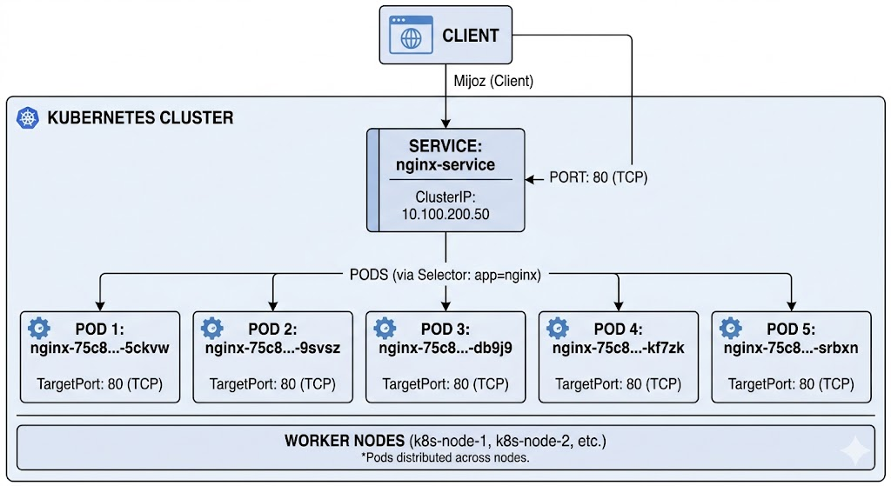

### Servis yaratish maqsadi.
Servislar, Kubernetes klasteridagi podlar va tashqi dunyo "o'rtasida tarmoq aloqalarini boshqarish uchun ishlatiladi". Servislar, podlar orasidagi tarmoq aloqalarini boshqarish, yuk balanslash, va tashqi dunyo bilan aloqa qilish uchun ishlatiladi. Servislar, podlar orasidagi tarmoq aloqalarini boshqarish, yuk balanslash, va tashqi dunyo bilan aloqa qilish uchun ishlatiladi.



'Xozir biz kubernetis klasterda virtula IP manzil yaratamiz va uni nginx-deploy deploymantiga bog'laymiz. Bu, masalan, nginx serverini tashqi dunyo bilan aloqa qilish uchun foydalidir. Servis yaratish uchun quyidagi buyruqni ishlatamiz:
```
kubectl expose deployment <deploymant-name> --port=<port> --target-port=<target-port> -n <namespace>
misol uchun nginx-deploy deploymantini 80 portida ochish uchun quyidagi buyruqni ishlatamiz:
kubectl expose deployment nginx-deploy --port=80 --target-port=80 -n default
```
Bu buyruq yordamida siz `nginx-deploy` deploymantini 80 portida ochishingiz mumkin. Bu, masalan, nginx serverini tashqi dunyo bilan aloqa qilish uchun foydalaniladi.
```kubectl get services -n <namespace>
kubectl get services -A
```
```
 root@test-server-k8s-1:~# kubectl get services
NAME           TYPE        CLUSTER-IP     EXTERNAL-IP   PORT(S)   AGE
kubernetes     ClusterIP   10.96.0.1      <none>        443/TCP   17d
nginx-deploy   ClusterIP   10.105.45.44   <none>        80/TCP    2m51s
```
bu buyruq orqali biz 2 ta servisni ko'rishimiz mumkin: `kubernetes` va `nginx-deploy`. `kubernetes` servisi, klaster ichidagi API serverga kirish uchun ishlatiladi, va `nginx-deploy` servisi, `nginx-deploy` deploymantiga bog'langan servisdir. Bu, masalan, klasterdagi servislarning holatini tekshirish yoki ularning turlarini ko'rish uchun foydalidir. 

```
kubectl describe service <service-name> -n <namespace>
misol uchun:
root@test-server-k8s-1:~# kubectl describe service nginx-deploy -n default
```
bu unda biz quidagi ma'lumotlarni ko'rishimiz mumkin:
```
Name:                     nginx-deploy
Namespace:                default
Labels:                   app=nginx-deploy
Annotations:              <none>
Selector:                 app=nginx-deploy
Type:                     ClusterIP
IP Family Policy:         SingleStack
IP Families:              IPv4
IP:                       10.105.45.44
IPs:                      10.105.45.44
Port:                     <unset>  80/TCP  ## Bu yesda servisning porti. Tashqaridan bu port orqali servisga murojaat qilinadi.
TargetPort:               80/TCP ## Bu yerda servis target porti, ya'ni u bog'langan podlarning porti
Endpoints:                172.16.78.130:80,172.16.78.129:80,172.16.91.66:80 + 2 more... ## Bu yerda podlarning IP manzillari va po'rtlarini ko'rishingiz mumkin. Bu, masalan, servisning qaysi podlarga bog'langanligini tekshirish yoki uning ichida nechta podlar ishga tushganligini ko'rsatadi.
Session Affinity:         None
Internal Traffic Policy:  Cluster
Events:                   <none>
```
Bu yerda `kubectl describe service nginx-deploy -n default` buyruq yordamida `nginx-deploy` servisining batafsil ma'lumotlarini ko'rishingiz mumkin. Bu, masalan, servisning turlarini tekshirish yoki uning qaysi podlarga bog'langanligini ko'rish uchun foydalidir. Bu yerda `Endpoints` qismida servisning bog'langan podlarning IP manzillari va po'rtlari ko'rsatilgan. Bu, masalan, servisning qaysi podlarga bog'langanligini tekshirish yoki uning ichida nechta podlar ishga tushganligini ko'rsatadi.
